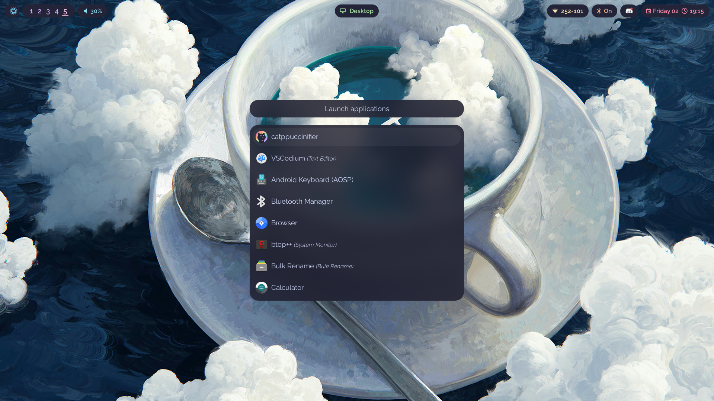
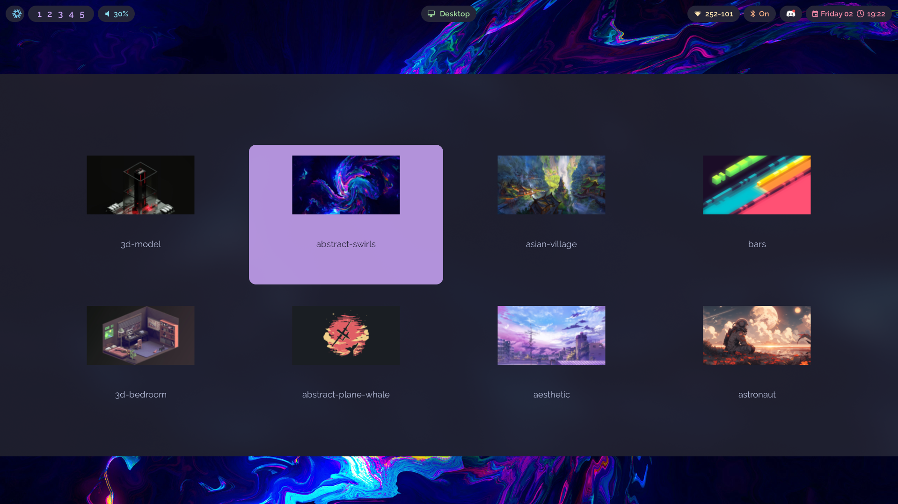
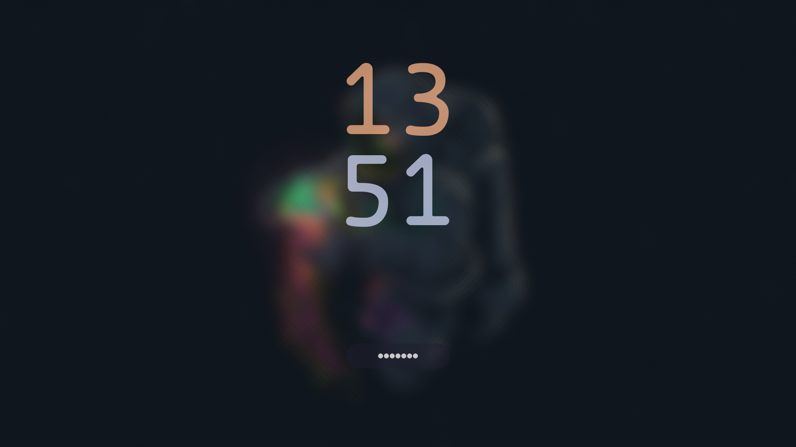
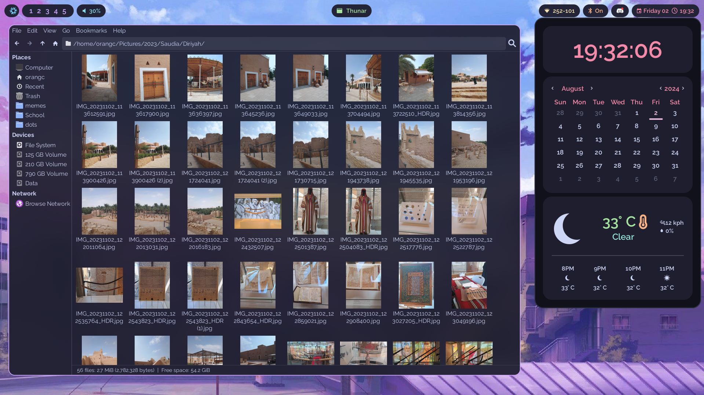
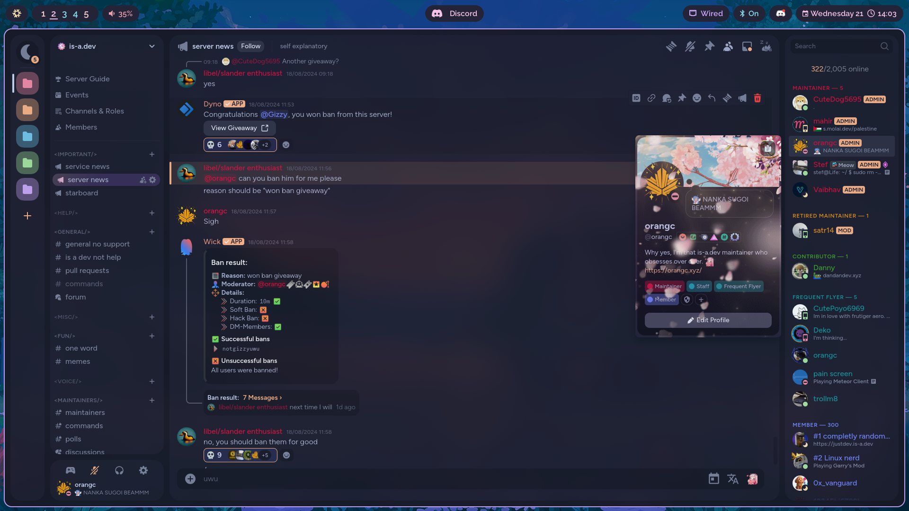
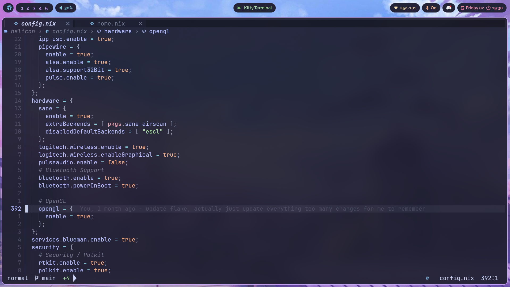
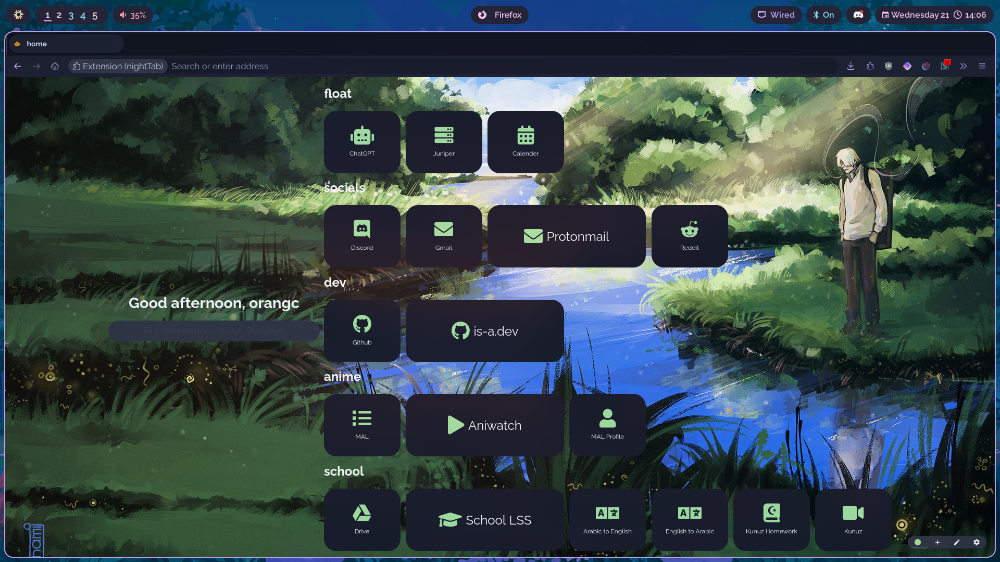

# orangc's flake

A smol (_not really small; excluding my home folder it is 44GB, I'm trying to reduce this_) n' cozy NixOS with Hyprland flake.

## Screenshots

<details> 
<summary>Rofi</summary>




</details>

<details>
<summary>Hyprlock</summary>



</details>

<details> 
<summary>Minecraft launcher</summary>


</details>

<details> 
<summary>ags & thunar</summary>


</details>

<details> 
<summary>Discord</summary>


</details>

<details> 
<summary>nvim</summary>


</details>

<details> 
<summary>wlogout</summary>


</details>

<details> 
<summary>firefox & nighttab</summary>


</details>

## Installation

Run this command in your terminal and the script will handle the rest. Note that this won't work for non NixOS users. If the script breaks in anyway, please make an issue and notify me. It shouldn't, though.

```sh
nix-shell -p curl # You can skip to the next line if you already have curl installed.
sh <(curl -L https://raw.githubusercontent.com/orxngc/dots/main/install.sh)
```

Note: I strongly advise you to read the code of the script [here](github.com/orxngc/dots/blob/main/install.sh) before running it. Always read and thoroughly check scripts you see online for your own safety..!

Press `SUPER + ?` to open a list of all keybindings.

## Structure Overview

This is a very modular flake.

- [`.github`](.github) The assets files for the README.
- [`files`](files) Files which various home-manager modules utilize.
  - [`fonts`](files/fonts) This is where you can place fonts that are not available in nixpkgs.
- [`hm-modules`](hm-modules) All home-manager modules are stored in here.
  - [`core`](hm-modules/core) Important things, like the hyprland module.
  - [`programs`](hm-modules/programs) The majority of program modules.
  - [`styles`](hm-modules/styles) Now this one you should touch. A big chunk of the system is themed here (the rest are themed in hm-modules/programs).
- [`hosts`](hosts) This is where each host's unique configurations go. You can configure/toggle the different modules and hm-modules for each host here.
- [`modules`](modules) NixOS system modules.
  - [`core`](modules/core) There's no reason to touch this.
  - [`drivers`](modules/core) Again, no reason to touch these.
  - [`programs`](modules/programs) Honestly not a reason to touch these either.
- [`scripts`](scripts) This is where I store all my scripts.
- [`flake.nix`](flake.nix) Where the flake begins, the lovely starting pont.

## Programs

<details>
<summary>Here's a list of some of the programs you'll find used here.</summary>

- `hyprland`
- `rofi`
- `micro`
- `vscodium`
- `thunar`
- `kitty`
- `ags`
- `firefox`
- `hyprlock`
</details>

## Todo

<details> 
<summary>Completed</summary>

- [x] ~~Write an installation script.~~
- [x] ~~Create a rofi wallpaper selector thing.~~
- [x] ~~Make swaync notifications pretty.~~
- [x] ~~Make those annoying folders in $HOME disappear, they aren't welcome.~~
- [x] ~~Add something that lists all the keybindings.~~
- [x] ~~Move back to SDDM or some other DM because I want something pretty.~~
- [x] ~~Update README screenshots.~~
- [x] ~~Make a screen recording script with wf-recorder.~~
- [x] ~~Cleanup/optimize the flake — try to make it take up less disk space.~~
- [x] ~~Make both browsers declarative.~~
- [x] ~~Fix the installation script.~~
- [x] ~~Fix MIME types.~~
- [x] ~~Restructure the flake and make it modular.~~
- [x] ~~Make Vencord fully declarative.~~
- [x] ~~Use the VScodium home-manager module to its fullest extent.~~
- [x] ~~Make Hyprpanel fully declarative; also maybe make a PR that adds home-manager options to that flake.~~
- [x] ~~Switch to standalone home-manager.~~
</details>

- [ ] Implement impermanence. It seems pretty nice.
- [ ] Make Stylix theme 100% of everything, not 80%.
- [ ] Figure out a way to make Firefox extension _data_ declarative. I've already made installing extensions declarative.
- [ ] Figure out how to deal with secrets.
- [ ] Make the flake more.. nixy. This is, I'd say, 70% done. I still have things to do like make my Hyprland config use the home-manager module in a nixy sort of way.

## Last but not least, credits!

<details>
<summary>Thank you!</summary>

- the vimjoyer youtube channel, for making immensely helpful videos that saved me hours and hours of pain
- https://github.com/NotAShelf/nyx/ — teaching me how many different parts of how nix works, and many tidbits of code
- https://gitlab.com/Zaney/zaneyos — teaching me how many different parts of how nix works, and several tidbits of code
- https://github.com/Jas-SinghFSU/HyprPanel — The ags configuration that I use.
- https://github.com/MrVivekRajan/Hypr-Dots — The hyprlock config inspiration.
- https://github.com/zDyanTB/HyprNova - The wlogout styling.
- https://github.com/elythh/nixvim — The neovim configuration I use.
- https://github.com/1amSimp1e/dots — i tweaked my starship prompt based off of this guy's prompt

</details>
